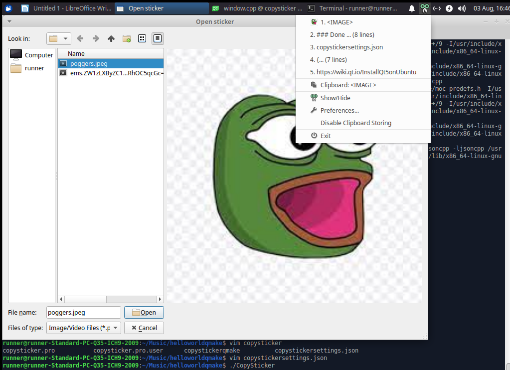

# CopySticker

Copies Stickers to your clipboard. Works fine on any messaging app Whatsapp, Facebook Messenger, Discord, etc. 

Reads the configurations from `copystickersettings.json`. A sample has been provided [here](https://github.com/burntfalafel/CopySticker/blob/master/copystickersettings.json).
Download the binary from the releases section! 
### Usage

This app runs in a loop. You can select the sticker you want and click `OK`. It is then copied to your clipboard. Once you have copy-pasted all the stickers you wanted and you are done chatting, simply click on `Cancel`. The app then closes. Or simply kill it - your choice. 

### Build requirements
- [jsoncpp](https://github.com/open-source-parsers/jsoncpp)
- [QT5](https://wiki.qt.io/Install_Qt_5_on_Ubuntu)

### Build instructions
```
qmake
make
```

### Screenshots

